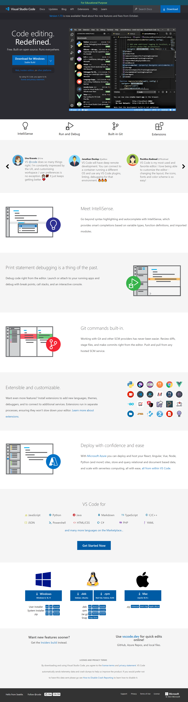

# Project Name : VScode Homepage UI Clone 

---

## About Me

**Hey, I'm Vyom Pundhir**

- I'm 22 and I live in Hathras, Uttar Pradesh. I'm currently learning **Full Stack Web Development**.

---

## Project Description

- In this project, I have built a **VScode Homepage UI Clone** from the scratch using core `HTML`, `CSS` & `Tailwind CSS`.

- This project is a complete `clone` of the `VScode Homepage` and all the transition effects and hover effects are same as the `Homepage` of `VScode` website.

- This project heavily relies on `flex-box` and various `flex properties` like `align-items, justify-content, gap `and `flex-direction`. Along with this the also comprises of `position property, various postions like absolute` and `a basic understanding of z-index` in `CSS` This project also comprises of `margin, padding, height, width, background, font-family, font-weight, font-size` properties of `CSS`.

- This project also comprises of `Hover effects` and `transitions` like `ease-in, ease-out`, etc.

- Note that I haven't made it **Responsive** to **Different Screen Sizes**, so it will work only on the laptop screen. If you are using Desktop, please zoom in or out, that might work.

---

## Technologies Used

- HTML

- CSS

---

## What I have Learnt in this Project

- Good understanding of `HTML` & `CSS` & `Tailwind CSS`.

- `flex` property of `CSS`:

  - how the `flex` property can be used to **align the elements present in column as row and with the help of flex properties the elements can be placed at any position**.

  - how we can use the `float` property to make 2 `div` come together in a row without using `CSS Flexbox`

- `position` property of `CSS`:

  - how the `position` property can be used to **align the elements using `absolute` and with the use of `z-index` the elements can be overlapped on one-another.**

- `margin` and `padding` property of `CSS`:

  - how the `margin` and `padding` properties can be used to adjust the position of an element.

-**Hover Effects and Transitions**
  - This project helped me to learn about hover effects and the Transitions that can be applied to the elements.

- **Properties** used to edit the look of Button and Fonts:

  - learnt about how the property `border, border-radius, color, font-weight, font-family, font-size` to edit buttons and fonts.

---

## Time Taken to Finish this Project

> I took around **4 Days** to complete this project. The only thing that has taken much time to be implemented is how to adjust the **Remarks and Comment Section.**
---

I'm definitely more confident now in creating a webpage similar to this one.

---

## Feedback

> For any kind of feedback, please contact me on my email: vyom.pundhir.prof@gmail.com
---

## Project Screenshot

> 
---